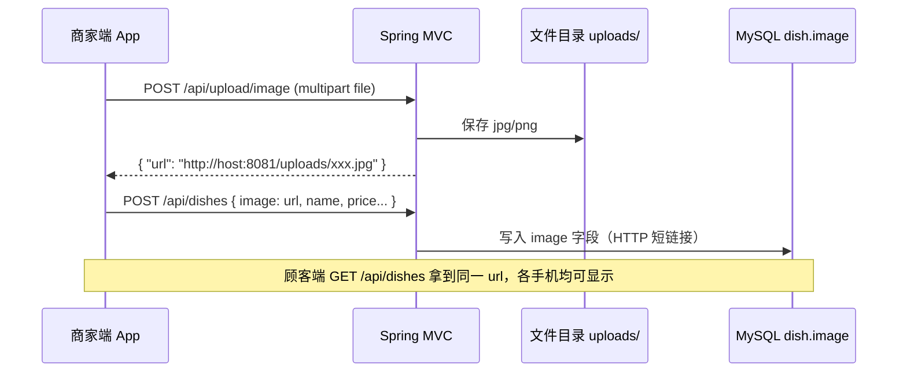

# 菜品图片上传 · 后端对接说明

> 版本：与 UniApp 前端 `uniapp-baoleme` 当前实现一致  
> 约定接口：`POST /api/upload/image`（**唯一**上传入口）

---

## 一、业务流程



**禁止**：把 Base64 大图放进 `POST /api/dishes` 的 `image` 字段（会超长或入库失败）。

---

## 二、上传接口规格

### 2.1 基本信息

| 项目 | 值 |
|------|-----|
| 方法 | `POST` |
| 路径 | `/api/upload/image` |
| Content-Type | `multipart/form-data` |
| 表单字段名 | **`file`**（与前端 `uni.uploadFile` 的 `name` 一致） |
| 鉴权 | 与现有接口相同，Header：`Authorization: Bearer {token}`（若已启用） |

### 2.2 请求示例（curl）

```bash
curl -X POST "http://192.168.1.10:8081/api/upload/image" \
  -H "Authorization: Bearer YOUR_TOKEN" \
  -F "file=@/path/to/dish.jpg"
```

### 2.3 成功响应

**HTTP 200**，`Content-Type: application/json`：

```json
{
  "url": "http://192.168.1.10:8081/uploads/dish_20260526143022_a1b2c3d4.jpg",
  "filename": "dish_20260526143022_a1b2c3d4.jpg",
  "size": 84312
}
```

| 字段 | 必填 | 说明 |
|------|------|------|
| `url` | **是** | 完整可访问 HTTP 地址，长度建议 ≤ 500，前端写入 `dish.image` |
| `filename` | 否 | 服务器保存的文件名 |
| `size` | 否 | 字节数 |

前端只依赖 **`url`**；`url` 也可为相对路径 `/uploads/xxx.jpg`，前端会自动拼上 `BASE_URL`。

### 2.4 失败响应

```json
{
  "message": "文件不能为空",
  "code": 400
}
```

| HTTP 状态 | 场景 |
|-----------|------|
| 400 | 未传 file、格式不允许、超过大小限制 |
| 401 | 未登录 / Token 无效 |
| 413 | 文件过大（调整 multipart 上限） |
| 500 | 磁盘写入失败等 |

---

## 三、与菜品接口的配合

### 3.1 新增菜品

```
POST /api/dishes
Content-Type: application/json
```

```json
{
  "name": "蛋炒米粉套餐",
  "price": 26.8,
  "description": "描述",
  "category": "热销推荐",
  "stock": 20,
  "image": "http://192.168.1.10:8081/uploads/dish_xxx.jpg"
}
```

- `image`：**仅填上传接口返回的 url**，不要填 Base64。
- `id`：可选；不传则由后端生成。

### 3.2 更新菜品（换图）

1. 先 `POST /api/upload/image` 拿到新 `url`
2. 再 `PUT /api/dishes/{id}`，`{ "image": "新url", ... }`

---

## 四、Spring MVC 参考实现（SSM）

### 4.1 `UploadController.java`

```java
package com.baoleme.controller;

import org.springframework.web.bind.annotation.*;
import org.springframework.web.multipart.MultipartFile;

import javax.servlet.http.HttpServletRequest;
import java.io.File;
import java.io.IOException;
import java.util.HashMap;
import java.util.Map;
import java.util.UUID;

@RestController
@RequestMapping("/api")
public class UploadController {

    /** 物理目录：Tomcat 下建议放在 webapps/uploads 或项目外部目录 */
    private static final String UPLOAD_DIR = "uploads";

    @PostMapping("/upload/image")
    public Map<String, Object> uploadImage(
            @RequestParam("file") MultipartFile file,
            HttpServletRequest request) throws IOException {

        if (file == null || file.isEmpty()) {
            throw new IllegalArgumentException("文件不能为空");
        }

        String contentType = file.getContentType();
        if (contentType == null
                || (!contentType.startsWith("image/jpeg")
                && !contentType.startsWith("image/png")
                && !contentType.startsWith("image/webp"))) {
            throw new IllegalArgumentException("仅支持 jpg/png/webp");
        }

        // 2MB 上限（可按需调整）
        if (file.getSize() > 2 * 1024 * 1024) {
            throw new IllegalArgumentException("图片不能超过 2MB");
        }

        String ext = ".jpg";
        if (contentType.contains("png")) ext = ".png";
        else if (contentType.contains("webp")) ext = ".webp";

        String filename = "dish_" + System.currentTimeMillis() + "_"
                + UUID.randomUUID().toString().substring(0, 8) + ext;

        String realPath = request.getServletContext().getRealPath("/" + UPLOAD_DIR);
        File dir = new File(realPath);
        if (!dir.exists() && !dir.mkdirs()) {
            throw new IOException("无法创建上传目录");
        }

        File dest = new File(dir, filename);
        file.transferTo(dest);

        String base = request.getScheme() + "://" + request.getServerName()
                + ":" + request.getServerPort();
        String url = base + "/" + UPLOAD_DIR + "/" + filename;

        Map<String, Object> result = new HashMap<>();
        result.put("url", url);
        result.put("filename", filename);
        result.put("size", file.getSize());
        return result;
    }
}
```

### 4.2 `spring-mvc.xml`  multipart 配置

```xml
<bean id="multipartResolver"
      class="org.springframework.web.multipart.commons.CommonsMultipartResolver">
    <property name="maxUploadSize" value="5242880"/>
    <property name="defaultEncoding" value="UTF-8"/>
</bean>
```

> 依赖：`commons-fileupload`、`commons-io`。

### 4.3 静态资源访问

保证 `http://服务器:端口/uploads/xxx.jpg` 可访问：

**方式 A**：文件保存在 `webapps/ROOT/uploads/`，Tomcat 默认可访问。

**方式 B**：`spring-mvc.xml` 映射：

```xml
<mvc:resources mapping="/uploads/**" location="/uploads/"/>
```

### 4.4 全局异常（返回 JSON message）

```java
@ExceptionHandler(IllegalArgumentException.class)
@ResponseStatus(HttpStatus.BAD_REQUEST)
public Map<String, String> handleBadRequest(IllegalArgumentException e) {
    Map<String, String> m = new HashMap<>();
    m.put("message", e.getMessage());
    return m;
}
```

---

## 五、前端已实现说明（供联调核对）

| 文件 | 作用 |
|------|------|
| `src/api/upload.ts` | `uploadImage()` → `POST /api/upload/image` |
| `src/api/dishes.ts` | `uploadDishImage()` 封装 |
| `src/utils/dishImageSubmit.ts` | 新增/编辑前先上传，拿 `url` 再调 dishes 接口 |
| `src/pages/merchant/sku.vue` | 商家菜品管理页 |

**BASE_URL**：登录页设置或 `src/api/config.ts` 默认 `http://192.168.1.10:8081`。

---

## 六、联调检查清单

- [ ] `POST /api/upload/image` 返回 200 且含 `url`
- [ ] 浏览器/App 能直接打开该 `url` 看到图片
- [ ] `POST /api/dishes` 的 `image` 为上述 `url` 字符串
- [ ] 顾客端 `GET /api/dishes` 返回相同 `image`，多台手机显示一致
- [ ] CORS / multipart 大小 / 鉴权与现有 `/api/dishes` 一致

---

## 七、常见问题

**Q：仍提示「上架失败」？**  
A：看 Toast 具体文案；多为上传 404（接口未部署）、413（文件过大）、或 `url` 字段未返回。

**Q：能否把图片存数据库 BLOB？**  
A：可以，但需改接口契约；当前前后端约定为 **文件 + URL**，与规格书 `dish.image` 字段一致。

**Q：生产环境域名不同？**  
A：`UploadController` 中拼接 `url` 时改为配置项 `app.public-base-url=https://api.xxx.com`。
